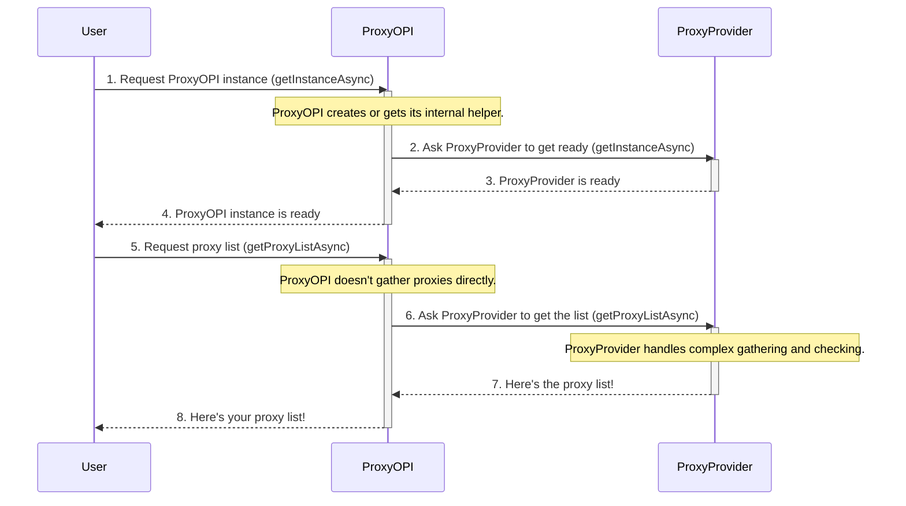

# Chapter 1: Proxy API Entry Point (ProxyOPI)

Welcome to the first chapter of our `proxyOPI` tutorial! We're excited to help you understand how to easily get free proxies for your projects.

Imagine you're checking into a hotel. You don't go to the kitchen, the laundry room, or the maintenance closet to get your room key, right? You go to the **front desk**. The front desk is your single point of contact, and they handle everything, from giving you your key to connecting you with other services.

In the `proxyOPI` library, the **`ProxyOPI` class is exactly like that front desk.** It's the main entry point where you, as a user, will interact to get what you need: a list of free proxies.

### What Problem Does ProxyOPI Solve?

Finding reliable, free proxies on the internet can be a real headache. You'd have to visit many websites, scrape their data, check if the proxies actually work, and then keep track of them. It's a lot of work!

`ProxyOPI` solves this problem by taking all that complex work off your shoulders. It provides a super simple way to get a fresh list of proxies without you needing to worry about *how* they are found, validated, or managed.

### Your First Step: Getting Proxies

Let's look at the central use case for `ProxyOPI`: **"How do I get a list of proxies using this library?"**

Here's how you'd typically do it:

First, you need to import `ProxyOPI` into your project. Think of this as knowing where the hotel's front desk is.

```typescript
import { ProxyOPI } from "@yasir.erkam/proxyopi";
```

Next, you need to "check in" or get access to the front desk. Since `ProxyOPI` handles a lot of behind-the-scenes setup, you'll get an instance of it using a special `getInstanceAsync` method. This method also takes a path to a JSON file, which `proxyOPI` might use to store or manage proxy lists.

```typescript
// Get the ProxyOPI "front desk" instance
// Replace "./path/to/proxyListTS.json" with your desired file path
const proxyOPI = await ProxyOPI.getInstanceAsync("./path/to/myProxies.json");
```

After running this code, `proxyOPI` will hold your "front desk" object, ready to take your requests.

Finally, to get your list of proxies, you simply ask the `proxyOPI` instance. It will fetch them for you.

```typescript
// Ask the front desk for a list of proxies
const proxyListTS = await proxyOPI.getProxyListAsync();

// Now, 'proxyListTS' contains your list of proxies!
console.log(`Found ${proxyListTS.list.length} proxies.`);
// Example of accessing a proxy (we'll learn more about Proxy objects later!)
if (proxyListTS.list.length > 0) {
    console.log(`First proxy: ${proxyListTS.list[0].ip}:${proxyListTS.list[0].port}`);
}
```

When you run `proxyOPI.getProxyListAsync()`, `ProxyOPI` does all the heavy lifting to find, check, and return a list of proxies to you. You get a `ProxyListTS` object, which is like a special container holding all the proxy information. We'll dive into what `Proxy` and `ProxyListTS` mean in [Chapter 3: Proxy Data Models](03_proxy_data_models__proxy__proxylistts__protocol__anonymitylevel__.md).

### Behind the Scenes: How ProxyOPI Works

You now know how to *use* `ProxyOPI`. But what happens when you call `getProxyListAsync()`? Does `ProxyOPI` itself go out and gather proxies from various websites?

Not exactly. Just like the hotel front desk doesn't cook your breakfast or clean your room, `ProxyOPI` doesn't directly find or manage the proxies. Instead, it delegates these tasks to specialized helpers.

Here's a simplified look at the interaction:



As you can see, when you ask `ProxyOPI` for proxies (step 5), it turns around and asks another core component, the **`ProxyProvider`** (step 6), to do the actual work. `ProxyOPI` acts as a coordinator, making sure your request is handled by the right internal system and then giving you the final result.

Let's peek at the code in `src/index.ts` to see how this delegation happens:

```typescript
// src/index.ts
import ProxyProvider from "./proxyProvider.js"; // We'll learn about this helper next!
import { ProxyListTS } from "./types.js";

export class ProxyOPI {
    private static instance: ProxyOPI;
    private proxyProvider!: ProxyProvider; // ProxyOPI holds a reference to its helper

    private constructor() {
        // This makes sure you can't create ProxyOPI directly
        // You must use getInstanceAsync
    }

    public static async getInstanceAsync(pathProxyList: string) {
        if (this.instance === undefined || this.instance === null) {
            this.instance = new ProxyOPI();
            // Here, ProxyOPI creates its helper, the ProxyProvider
            this.instance.proxyProvider = await ProxyProvider.getInstanceAsync(pathProxyList);
        }
        return this.instance;
    }

    async getProxyListAsync(timeout: number = 4 * 60): Promise<ProxyListTS> {
        // Check if the helper is ready
        if (this.proxyProvider === undefined || this.proxyProvider === null)
            throw new Error("\nProxy provider is undefined or null.");

        // Instead of getting proxies itself, ProxyOPI asks its helper!
        return await this.proxyProvider.getProxyListAsync(timeout);
    }
}
```

In this code:
*   The `ProxyOPI` class has a special `private constructor()`. This is a design pattern that ensures you can only get a `ProxyOPI` object through its static `getInstanceAsync` method. This helps manage the single "front desk" for your application.
*   The `getInstanceAsync` method is where `ProxyOPI` prepares itself. It creates an instance of `ProxyProvider` and stores it internally. This is like the front desk manager making sure all staff (like `ProxyProvider`) are in place.
*   The `getProxyListAsync` method doesn't contain any logic for finding proxies. It simply calls `this.proxyProvider.getProxyListAsync(timeout)`. This clearly shows `ProxyOPI`'s role as a delegator.

### Conclusion

In this chapter, you've learned that `ProxyOPI` is the main entry point for interacting with the `proxyOPI` library. It acts as a simple, clean interface—much like a hotel's front desk—allowing you to easily request a list of proxies without needing to understand the complex internal details. You also saw that `ProxyOPI` delegates the actual work of proxy management to other components, specifically the `ProxyProvider`.

Now that you understand `ProxyOPI`'s role, you're ready to dive deeper into how it manages to get those proxies for you!

[Next Chapter: Proxy List Manager (ProxyProvider)](02_proxy_list_manager__proxyprovider__.md)

---

<sub><sup>Generated by [AI Codebase Knowledge Builder](https://github.com/The-Pocket/Tutorial-Codebase-Knowledge).</sup></sub> <sub><sup>**References**: [[1]](https://github.com/yasirerkam/proxyOPI/blob/de777b25b178688cfd9509a60298c2a610fb318d/README.md), [[2]](https://github.com/yasirerkam/proxyOPI/blob/de777b25b178688cfd9509a60298c2a610fb318d/package.json), [[3]](https://github.com/yasirerkam/proxyOPI/blob/de777b25b178688cfd9509a60298c2a610fb318d/src/index.ts)</sup></sub>
