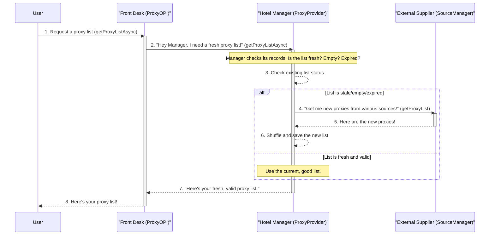

# Chapter 2: Proxy List Manager (ProxyProvider)

Welcome back! In [Chapter 1: Proxy API Entry Point (ProxyOPI)](01_proxy_api_entry_point__proxyopi__.md), we learned that `ProxyOPI` is your friendly front desk for getting proxies. We also discovered that `ProxyOPI` doesn't do all the work itself. Instead, it delegates the heavy lifting to other specialized components.

One of the most important helpers `ProxyOPI` relies on is the **`ProxyProvider`**. Think of `ProxyProvider` as the **"Hotel Manager"** for our proxy lists.

### What Problem Does ProxyProvider Solve?

Imagine you're the front desk (ProxyOPI), and a guest asks for a room. You don't just hand them any old room key! You need to know:
*   Are there any rooms available right now?
*   Are the rooms clean and ready? (Are the proxies fresh and working?)
*   Has the list of available rooms expired? (Proxies get stale quickly!)
*   If not, where do I get new rooms from?

Manually managing a list of proxies – checking if they're still valid, knowing when to get new ones, and where to get them – is a full-time job. This is the problem `ProxyProvider` solves!

`ProxyProvider` acts as the intelligent manager that ensures a reliable and fresh list of proxies is *always* ready. It takes care of checking, refreshing, and organizing the proxy lists so `ProxyOPI` (and ultimately you) can get a good list whenever needed.

### The ProxyProvider's Job: Always Have Fresh Proxies

The main goal of `ProxyProvider` is simple: when `ProxyOPI` asks for a proxy list, `ProxyProvider` must provide one that is **current, valid, and available**.

Here's how our "Hotel Manager" (ProxyProvider) handles a request for a proxy list:

1.  **Check the Current List:** It first looks at its existing inventory of proxies.
2.  **Is it Fresh?** It checks if the list is too old (proxies can stop working quickly!).
3.  **Is it Empty?** Does it have any proxies at all?
4.  **If Not Fresh or Empty:** If the list is outdated, empty, or missing, the manager knows it's time to get a brand new one.
5.  **Get New Proxies:** It sends out a request to "external suppliers" (which we'll learn about in [Chapter 4: External Proxy Gatherer (SourceManager)](04_external_proxy_gatherer__sourcemanager__.md)) to fetch a fresh batch.
6.  **Shuffle for Fairness:** Once new proxies arrive, it shuffles them randomly. This ensures that every proxy gets a fair chance of being used, and you don't keep getting the same few proxies over and over.
7.  **Save for Next Time:** It saves this new, fresh, and shuffled list so it can be quickly retrieved later.
8.  **Hand Over the List:** Finally, it gives the ready-to-use list to `ProxyOPI`.

### How ProxyOPI Uses ProxyProvider (Behind the Scenes)

Let's revisit the sequence of events from [Chapter 1](01_proxy_api_entry_point__proxyopi__.md), but now focusing on `ProxyProvider`'s role:



As you can see, `ProxyProvider` is where the intelligent decision-making about managing the proxy list actually happens. `ProxyOPI` just trusts `ProxyProvider` to do its job.

### Diving into the Code (`src/proxyProvider.ts`)

Let's look at some simplified code snippets from `src/proxyProvider.ts` to see how our "Hotel Manager" works.

#### Initializing the Manager (`getInstanceAsync`)

Just like `ProxyOPI`, `ProxyProvider` is set up using a special `getInstanceAsync` method. This method ensures that the `ProxyProvider` manager is ready to go, and it tries to load any previously saved proxy list.

```typescript
// src/proxyProvider.ts
import JsonFileOps from "./jsonFileOps.js"; // For saving/loading lists
import SourceManager from "./sourceManager.js"; // For getting new proxies
import { ProxyListTS, Proxy } from "./types.js";

export default class ProxyProvider {
    private static instance: ProxyProvider; // Ensures only one manager
    sourceManager!: SourceManager; // Our "external supplier"

    // ... (other properties and methods) ...

    static async getInstanceAsync(pathProxyList: string): Promise<ProxyProvider> {
        if (!this.instance) {
            this.instance = new ProxyProvider(pathProxyList);

            // First, get the "external supplier" ready
            await SourceManager.getInstanceAsync().then(async sourceManager => {
                this.instance.sourceManager = sourceManager;
            }).then(async () => {
                // Then, try to read any proxy list saved from before
                await this.instance.readProxyListObjFileAsync();
            });
