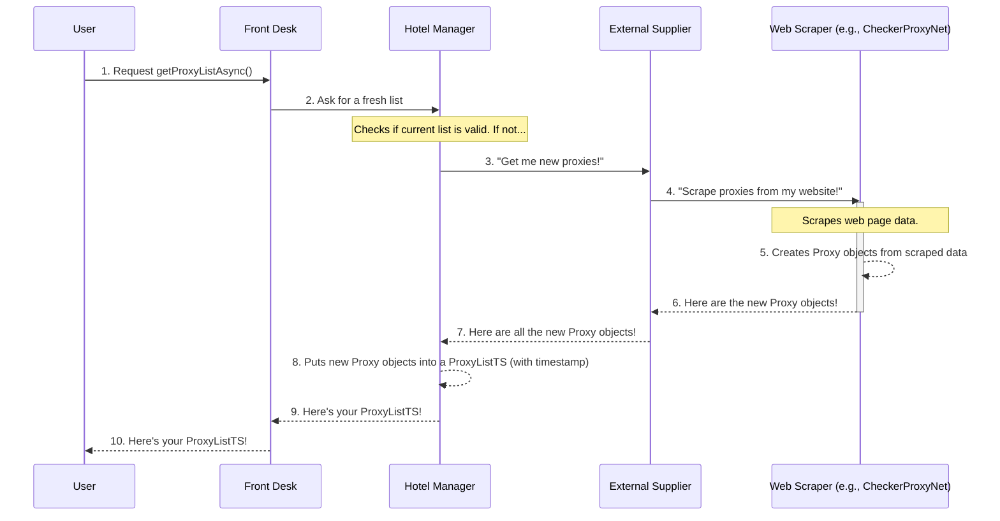

# Chapter 3: Proxy Data Models (Proxy, ProxyListTS, Protocol, AnonymityLevel)

Welcome back! In our previous chapters, we learned about `ProxyOPI`, the friendly front desk, and `ProxyProvider`, the diligent hotel manager. We saw how `ProxyProvider` works hard to always have a fresh list of proxies ready for you. When you ask for a list of proxies, `ProxyProvider` returns something called a `ProxyListTS`.

But what exactly *is* a `ProxyListTS`? And what does a single "proxy" look like in our system?

### What Problem Do Data Models Solve?

Imagine you're trying to describe a car to someone. You wouldn't just say "it's a car!" You'd describe its color, make, model, year, number of doors, engine type, etc. Without these specific details, communication would be confusing, and you might get a totally different car than you expected!

In programming, we face a similar challenge. When different parts of our `proxyOPI` project talk about a "proxy," they need a common language—a clear definition of what information a proxy contains. This is where **Proxy Data Models** come in.

These data models are like the **"blueprints" or "recipes"** for the information used throughout the project. They define:
*   What categories of information exist (like `Protocol` and `AnonymityLevel`).
*   What an individual proxy looks like (`Proxy` with its IP address, port, and other details).
*   How a collection of proxies is packaged together (`ProxyListTS` with a timestamp and the list of individual proxies).

They ensure that everyone in the `proxyOPI` system understands and uses proxy information in the exact same way, making the whole system consistent and easy to work with.

### Your Goal: Understanding the Structure of Proxy Data

Let's focus on our central use case for this chapter: **"What does a single proxy look like, and how is a list of them structured when `proxyOPI` gives them to me?"**

By the end of this chapter, you'll clearly understand the basic building blocks of proxy information within the `proxyOPI` library.

---

### The Building Blocks of Proxy Information

Let's break down the key data models, starting with the simpler ones.

#### 1. `Protocol`: How Do We Connect?

When you connect to a website, you use a "protocol." Think of a protocol as a specific language or set of rules for communication. Just like you might speak English, Spanish, or French, a proxy might support different internet "languages."

In `proxyOPI`, `Protocol` is a simple list of standard connection types:

| Protocol Type | Description                                             |
| :------------ | :------------------------------------------------------ |
| `http`        | Standard web browsing.                                  |
| `https`       | Secure web browsing (encrypted).                        |
| `socks4`      | An older, general-purpose proxy protocol.               |
| `socks5`      | A newer, more versatile proxy protocol, supports UDP.   |
| `unknown`     | If we can't determine the protocol.                     |

**Why is this important?** When you use a proxy, you need to know *how* to talk to it. Some websites only work with HTTPS, so you'd need an HTTPS proxy.

#### 2. `AnonymityLevel`: How Hidden Are You?

Proxies are often used to hide your real IP address. But not all proxies hide you equally well! `AnonymityLevel` tells you how "anonymous" a proxy is.

| Anonymity Level | Description                                                               |
| :-------------- | :------------------------------------------------------------------------ |
| `transparent`   | Your real IP address is still visible to the website you visit. Not very anonymous! |
| `anonymous`     | Your real IP is hidden, but the website knows you're using a proxy.       |
| `elite`         | Your real IP is hidden, and the website *doesn't even know* you're using a proxy. This is the most anonymous. |
| `unknown`       | If we can't determine the anonymity level.                               |

**Why is this important?** Depending on your privacy needs, you might prefer an "elite" proxy over a "transparent" one.

#### 3. `Proxy`: The Individual Proxy's ID Card

Now that we know about `Protocol` and `AnonymityLevel`, we can define what a single `Proxy` looks like. Think of a `Proxy` object as an **ID card** for one specific proxy server. It contains all the essential information about that proxy.

Here are the main details on a `Proxy`'s ID card:

*   **`ipAddress`**: The unique internet address of the proxy server (e.g., "192.168.1.1").
*   **`port`**: The specific "door" on the server to connect through (e.g., 8080).
*   **`protocols`**: A list of the `Protocol` types this proxy supports (e.g., `[Protocol.http, Protocol.https]`).
*   **`source`**: The website or service where this proxy was found (e.g., "free-proxy-list.net").
*   **`anonymityLevel`**: How anonymous this proxy is (e.g., `AnonymityLevel.elite`).
*   **`lastTested`**: When the proxy was last checked to be working.
*   **`country`**, **`city`**: Geographic location of the proxy.
*   And other optional details like `speed`, `uptime`, `responseTime`, `isp`, `verified`.

**Example of a `Proxy` (in real life):**
A typical proxy might be like: `185.199.108.199:8080`.
Its ID card (`Proxy` object) would say:
*   IP Address: 185.199.108.199
*   Port: 8080
*   Protocols: HTTP, HTTPS
*   Anonymity Level: Elite
*   Source: proxyscrape.com
*   Country: US
*   ...and so on.

#### 4. `ProxyListTS`: The Box of ID Cards

Finally, `ProxyListTS` (which stands for "Proxy List with Timestamp") is the container that holds a collection of these `Proxy` objects, along with an important timestamp.

It has two main parts:

*   **`dateTime`**: A timestamp indicating *when* this list of proxies was last updated or fetched. This is crucial because proxies go stale quickly!
*   **`list`**: An array (a collection) of individual `Proxy` objects. This is the actual list of ID cards.

Think of `ProxyListTS` as a **box** for your proxy ID cards. On the outside of the box, there's a label with the date and time it was packed (`dateTime`). Inside the box are all the individual `Proxy` ID cards (`list`).

---

### How ProxyOPI Uses These Models

Let's revisit how you get proxies from `ProxyOPI` and see these data models in action.

You remember from [Chapter 1: Proxy API Entry Point (ProxyOPI)](01_proxy_api_entry_point__proxyopi__.md) that you get a `ProxyListTS` object:

```typescript
import { ProxyOPI } from "@yasir.erkam/proxyopi";

// 1. Get the ProxyOPI "front desk" instance
const proxyOPI = await ProxyOPI.getInstanceAsync("./path/to/myProxies.json");

// 2. Ask the front desk for a list of proxies
const proxyListTS = await proxyOPI.getProxyListAsync();

// 'proxyListTS' is now a ProxyListTS object!
console.log(`List generated on: ${new Date(proxyListTS.dateTime).toLocaleString()}`);
console.log(`Found ${proxyListTS.list.length} proxies.`);

// 3. Accessing individual Proxy objects from the list
if (proxyListTS.list.length > 0) {
    // 'firstProxy' is a Proxy object!
    const firstProxy = proxyListTS.list[0];

    console.log(`\nDetails of the first proxy:`);
    console.log(`  IP Address: ${firstProxy.ipAddress}`);
    console.log(`  Port: ${firstProxy.port}`);
    console.log(`  Protocols: ${firstProxy.protocols.join(", ")}`);
    console.log(`  Anonymity Level: ${firstProxy.anonymityLevel}`);
    console.log(`  Source: ${firstProxy.source}`);
    console.log(`  Country: ${firstProxy.country}`);
}
```

In this example:
*   `proxyListTS` is the `ProxyListTS` object, containing the `dateTime` and the `list` of proxies.
*   `proxyListTS.list` is the array of `Proxy` objects.
*   `firstProxy` is an individual `Proxy` object, and we can access its `ipAddress`, `port`, `protocols`, and other properties directly.

---

### Under the Hood: Where are these Models Defined?

These essential data models are all defined in a single, dedicated file: `src/types.ts`. This keeps all the "blueprints" in one place, making them easy to find and understand.

#### `src/types.ts` (Simplified)

```typescript
// src/types.ts

// The "languages" a proxy can speak
enum Protocol {
    http = "http",
    https = "https",
    socks4 = "socks4",
    socks5 = "socks5",
    unknown = "unknown"
};

// How hidden a proxy keeps you
enum AnonymityLevel {
    transparent = "transparent",
    anonymous = "anonymous",
    elite = "elite",
    unknown = "unknown"
};

// The blueprint for an individual Proxy's ID card
type Proxy = {
    ipAddress: string,
    port: number,
    protocols: Protocol[], // Can support multiple protocols
    source: string,
    anonymityLevel?: AnonymityLevel, // Optional, might be unknown
    lastTested?: string,
    country?: string,
    city?: string,
    // ... other optional fields like isp, speed, uptime, responseTime, verified
};

// The blueprint for the timestamped box of Proxy ID cards
type ProxyListTS = {
    dateTime: number, // Unix timestamp when the list was created
    list: Proxy[]     // The array of actual Proxy objects
};

export { Protocol, AnonymityLevel, Proxy, ProxyListTS };
```
This file acts as the dictionary for all proxy-related data structures in the `proxyOPI` library.

#### How Proxies are Created and Stored

When `ProxyProvider` (our "Hotel Manager" from [Chapter 2](02_proxy_list_manager__proxyprovider__.md)) needs new proxies, it asks the [SourceManager (Chapter 4)](04_external_proxy_gatherer__sourcemanager__.md). The `SourceManager` then uses various [Individual Proxy Source Scrapers (ISource, Chapter 5)](05_individual_proxy_source_scraper__isource__.md) to actually visit websites and find proxy information.

These scrapers are responsible for reading data from different web pages and then **transforming that raw data into `Proxy` objects** using our defined data models.

Here's a simplified look at the process:



Let's look at a quick example from `src/sources/checkerproxy_net.ts` (one of the scrapers) to see how it creates a `Proxy` object:

```typescript
// src/sources/checkerproxy_net.ts (simplified snippet)
import { Proxy, AnonymityLevel, Protocol } from "../types.js"; // Import our models!
import ISource from "./iSource.js";

export default class CheckerProxyNet implements ISource {
    // ... constructor and other methods ...

    async getProxyList(): Promise<Proxy[]> {
        const proxyList: Proxy[] = [];
        // ... (Playwright context and page setup) ...

        // Imagine 'proxies' is an array of raw data from the website
        const proxiesFromWebsite = [{ addr: "1.2.3.4:8080", type: 5, kind: 2, addr_geo_iso: "US" }]; // Simplified example

        for (let i = 0; i < proxiesFromWebsite.length; i++) {
            const proxyData = proxiesFromWebsite[i];
            const ipPort = proxyData.addr?.split(":");

            // Convert raw data to our standard Protocol and AnonymityLevel enums
            let types: Protocol[] = this.transformProtocol(proxyData.type ?? 0);
            let kind: AnonymityLevel = this.transformAnonymityLevel(proxyData.kind ?? 0);

            // Create a Proxy object using our defined 'Proxy' type!
            proxyList.push({
                ipAddress: ipPort[0],
                port: Number(ipPort[1]),
                protocols: types,
                source: this.source,
                anonymityLevel: kind,
                country: proxyData.addr_geo_iso,
                // ... other fields
            });
        }
        // ... (page close and context close) ...
        return proxyList;
    }

    // Helper methods to transform raw data to our enums
    transformProtocol(type: number): Protocol[] { /* ... logic ... */ return [Protocol.http]; }
    transformAnonymityLevel(kind: number): AnonymityLevel { /* ... logic ... */ return AnonymityLevel.anonymous; }
}
```
As you can see, the scraper takes the raw data it finds (like `proxyData.addr` and `proxyData.type`), transforms it into our standard `Protocol` and `AnonymityLevel` enums, and then builds a `Proxy` object to be added to the list. This ensures that no matter where the proxy comes from, it always looks the same to `ProxyOPI` and to you.

---

### Conclusion

In this chapter, you've gained a fundamental understanding of the core data models within the `proxyOPI` library. You now know that:
*   `Protocol` defines how a proxy communicates (e.g., HTTP, HTTPS).
*   `AnonymityLevel` describes how much a proxy hides your identity (transparent, anonymous, elite).
*   `Proxy` is the "ID card" for a single proxy, containing its IP, port, supported protocols, anonymity level, and other details.
*   `ProxyListTS` is the "timestamped box" that holds a collection of these `Proxy` objects, ensuring consistency and freshness.

These models are the backbone of all proxy-related information in the system, ensuring clarity and consistency from the moment a proxy is scraped to when it's delivered to you.

Now that you understand *what* a proxy looks like, let's explore *how* `ProxyProvider` gets these proxies from various external sources.

[Next Chapter: External Proxy Gatherer (SourceManager)](04_external_proxy_gatherer__sourcemanager__.md)

---

<sub><sup>Generated by [AI Codebase Knowledge Builder](https://github.com/The-Pocket/Tutorial-Codebase-Knowledge).</sup></sub> <sub><sup>**References**: [[1]](https://github.com/yasirerkam/proxyOPI/blob/de777b25b178688cfd9509a60298c2a610fb318d/src/index.ts), [[2]](https://github.com/yasirerkam/proxyOPI/blob/de777b25b178688cfd9509a60298c2a610fb318d/src/proxyProvider.ts), [[3]](https://github.com/yasirerkam/proxyOPI/blob/de777b25b178688cfd9509a60298c2a610fb318d/src/sourceManager.ts), [[4]](https://github.com/yasirerkam/proxyOPI/blob/de777b25b178688cfd9509a60298c2a610fb318d/src/sources/checkerproxy_net.ts), [[5]](https://github.com/yasirerkam/proxyOPI/blob/de777b25b178688cfd9509a60298c2a610fb318d/src/sources/cool-proxy_net.ts), [[6]](https://github.com/yasirerkam/proxyOPI/blob/de777b25b178688cfd9509a60298c2a610fb318d/src/sources/free-proxy-list_net.ts), [[7]](https://github.com/yasirerkam/proxyOPI/blob/de777b25b178688cfd9509a60298c2a610fb318d/src/sources/free-proxy_cz.ts), [[8]](https://github.com/yasirerkam/proxyOPI/blob/de777b25b178688cfd9509a60298c2a610fb318d/src/sources/hideip_me.ts), [[9]](https://github.com/yasirerkam/proxyOPI/blob/de777b25b178688cfd9509a60298c2a610fb318d/src/sources/hidemy_io.ts), [[10]](https://github.com/yasirerkam/proxyOPI/blob/de777b25b178688cfd9509a60298c2a610fb318d/src/sources/iSource.ts), [[11]](https://github.com/yasirerkam/proxyOPI/blob/de777b25b178688cfd9509a60298c2a610fb318d/src/sources/my-proxy_com.ts), [[12]](https://github.com/yasirerkam/proxyOPI/blob/de777b25b178688cfd9509a60298c2a610fb318d/src/sources/openproxy_space.ts), [[13]](https://github.com/yasirerkam/proxyOPI/blob/de777b25b178688cfd9509a60298c2a610fb318d/src/sources/pages/pageFreeProxyCz.ts), [[14]](https://github.com/yasirerkam/proxyOPI/blob/de777b25b178688cfd9509a60298c2a610fb318d/src/sources/pages/pageFreeProxyListNet.ts), [[15]](https://github.com/yasirerkam/proxyOPI/blob/de777b25b178688cfd9509a60298c2a610fb318d/src/sources/pages/pageHideMyIo.ts), [[16]](https://github.com/yasirerkam/proxyOPI/blob/de777b25b178688cfd9509a60298c2a610fb318d/src/sources/pages/pageMyProxyCom.ts), [[17]](https://github.com/yasirerkam/proxyOPI/blob/de777b25b178688cfd9509a60298c2a610fb318d/src/sources/pages/pageOpenproxySpace.ts), [[18]](https://github.com/yasirerkam/proxyOPI/blob/de777b25b178688cfd9509a60298c2a610fb318d/src/sources/pages/pagePremProxyCom.ts), [[19]](https://github.com/yasirerkam/proxyOPI/blob/de777b25b178688cfd9509a60298c2a610fb318d/src/sources/pages/pageProxyDailyCom.ts), [[20]](https://github.com/yasirerkam/proxyOPI/blob/de777b25b178688cfd9509a60298c2a610fb318d/src/sources/pages/pageProxyListOrg.ts), [[21]](https://github.com/yasirerkam/proxyOPI/blob/de777b25b178688cfd9509a60298c2a610fb318d/src/sources/pages/pageProxyNovaCom.ts), [[22]](https://github.com/yasirerkam/proxyOPI/blob/de777b25b178688cfd9509a60298c2a610fb318d/src/sources/premproxy_com.ts), [[23]](https://github.com/yasirerkam/proxyOPI/blob/de777b25b178688cfd9509a60298c2a610fb318d/src/sources/proxy-daily_com.ts), [[24]](https://github.com/yasirerkam/proxyOPI/blob/de777b25b178688cfd9509a60298c2a610fb318d/src/sources/proxy-list_org.ts), [[25]](https://github.com/yasirerkam/proxyOPI/blob/de777b25b178688cfd9509a60298c2a610fb318d/src/sources/proxynova_com.ts), [[26]](https://github.com/yasirerkam/proxyOPI/blob/de777b25b178688cfd9509a60298c2a610fb318d/src/sources/proxyscrape_com.ts), [[27]](https://github.com/yasirerkam/proxyOPI/blob/de777b25b178688cfd9509a60298c2a610fb318d/src/types.ts)</sup></sub>
