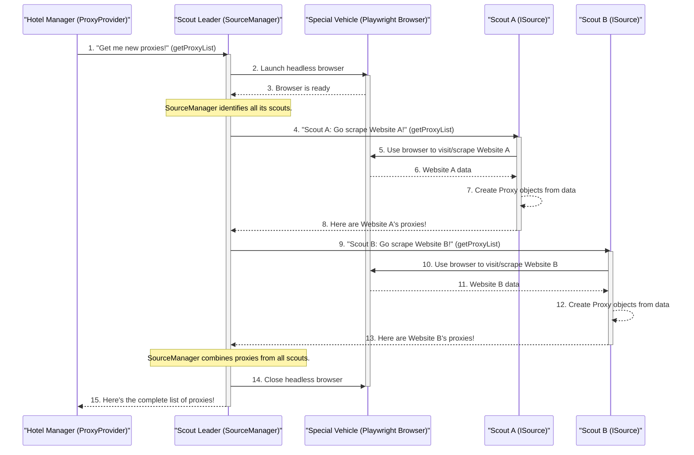

# Chapter 4: External Proxy Gatherer (SourceManager)

Welcome back to the `proxyOPI` journey! In our last chapter, [Chapter 3: Proxy Data Models (Proxy, ProxyListTS, Protocol, AnonymityLevel)](03_proxy_data_models__proxy__proxylistts__protocol__anonymitylevel__.md), we learned about the `Proxy` object – the "ID card" for a single proxy – and how `ProxyListTS` is a timestamped box of these cards.

Now, the big question is: **Where do these `Proxy` ID cards actually come from?** Who goes out into the vast internet to find them?

This is where the **`SourceManager`** comes in.

### What Problem Does SourceManager Solve?

Imagine our "Hotel Manager" (`ProxyProvider` from [Chapter 2: Proxy List Manager (ProxyProvider)](02_proxy_list_manager__proxyprovider__.md)) needs new, fresh proxies. There isn't just one place on the internet to get them. Proxies are listed on many different websites, and each website might have a unique way of presenting its data.

*   Some might have simple tables.
*   Others might require you to click buttons or navigate pages.
*   Some might even require solving a CAPTCHA.

Trying to manually visit all these websites, figure out how to extract the proxy information, and then combine it all into one list would be a huge, time-consuming mess!

The `SourceManager` solves this problem by acting as the **"External Proxy Gatherer"** or the **"Scout Leader."** Its job is to efficiently send out specialized "scouts" to collect proxies from many different websites, gather all their findings, and combine them into one comprehensive list of `Proxy` objects.

### Your Goal: Understanding How Proxies Are Collected

By the end of this chapter, you'll understand how `SourceManager` orchestrates the collection of proxies from various online sources, preparing them for the `ProxyProvider`.

---

### The SourceManager's Role: The Scout Leader

Think of `SourceManager` as the leader of an exploration team. When `ProxyProvider` (the "Hotel Manager") says, "I need a new list of proxies!", `SourceManager` takes charge.

Here's how it works:

1.  **Launches a Special Vehicle (Headless Browser)**: The `SourceManager` starts a special web browser that runs completely in the background, without showing any visible window. This "headless" browser is like a secret vehicle that the scouts will use to visit websites.
2.  **Dispatches Specialized Scouts (`ISource` implementations)**: `SourceManager` knows about many different proxy-listing websites. For each website, it has a specialized "scout" (an `ISource` implementation, which we'll learn more about in [Chapter 5: Individual Proxy Source Scraper (ISource)](05_individual_proxy_source_scraper__isource__.md)) that knows exactly how to navigate and extract proxies from *that specific site*. The `SourceManager` sends out all these scouts.
3.  **Collects All Findings**: As each scout finishes its mission and brings back a list of `Proxy` objects, the `SourceManager` collects all these individual lists.
4.  **Combines and Returns**: Finally, it merges all the collected proxies into one giant, comprehensive list, and then safely closes its special vehicle (the headless browser). This combined list is then given back to the `ProxyProvider`.

### How ProxyProvider Uses SourceManager (Behind the Scenes)

Let's look at a simplified sequence of events showing how `SourceManager` fits into the bigger picture:



This diagram shows that the `SourceManager` is the central orchestrator for gathering proxies. It launches the browser, tells individual `ISource` implementations (like `Scout A` and `Scout B`) to do their work, waits for them to finish, and then collects all their findings.

### Diving into the Code (`src/sourceManager.ts`)

Let's look at the `SourceManager` code in `src/sourceManager.ts` to see how it brings this "scout leader" role to life.

#### Initializing the Scout Leader (`getInstanceAsync`)

Just like `ProxyOPI` and `ProxyProvider`, `SourceManager` uses a `getInstanceAsync` method to ensure there's only one "Scout Leader" active at a time.

```typescript
// src/sourceManager.ts
import { chromium, Browser } from "playwright-core"; // Needed for the headless browser
import { Proxy } from "./types.js"; // To work with Proxy objects
import ISource from "./sources/iSource.js"; // The blueprint for our scouts

// ... (imports for individual ISource implementations) ...

export default class SourceManager {
    private static instance: SourceManager;
    sources?: ISource[]; // This will hold all our "scouts"
    browser?: Browser;   // This will hold our headless browser instance

    // ... (constructor and other properties) ...

    static async getInstanceAsync(): Promise<SourceManager> {
        if (this.instance === undefined || this.instance === null) {
            this.instance = new SourceManager();
        }
        return this.instance;
    }
}
```
This `getInstanceAsync` method ensures that `SourceManager` is ready to be used. The constructor might do some initial setup, like loading browser configuration from a file, using [JsonFileOps](07_json_file_handler__jsonfileops__.md).

#### The Core Method: `getProxyList`

This is the central method that `ProxyProvider` calls when it needs a fresh list of proxies. This is where the `SourceManager` launches its browser, dispatches its scouts, and collects the results.

```typescript
// src/sourceManager.ts (simplified getProxyList method)
export default class SourceManager {
    // ... (properties) ...

    async getProxyList(): Promise<Proxy[]> {
        let proxyList: Proxy[] = []; // This will store all collected proxies
        let promises: Promise<void>[] = []; // To track all scout missions

        // 1. Launch the special vehicle: a headless Chromium browser
        this.browser = await chromium.launch({ headless: true });
        console.log("\nHeadless browser launched.");

        // 2. Prepare our specialized scouts for different websites
        this.sources = [
            new ProxyScrapeCom(this.browser, this.browserContextOptions),
            new ProxyNovaCom(this.browser, this.browserContextOptions),
            new HideIpMe(this.browser, this.browserContextOptions),
            // ... (many more ISource implementations for different websites) ...
            new CheckerProxyNet(this.browser, this.browserContextOptions),
            new ProxyListOrg(this.browser, this.browserContextOptions),
        ];
        console.log(`Dispatched ${this.sources.length} scouts.`);

        // 3. Send out all scouts on their missions concurrently
        for (const source of this.sources) {
            const promise = source.getProxyList().then(proxies => {
                // As each scout returns, add its proxies to the main list
                proxyList = proxyList.concat(proxies);
                console.log(`Scout for ${source.sourceName} returned ${proxies.length} proxies.`);
            }).catch(error => {
                console.error(`Error from scout for ${source.sourceName}: ${error.message}`);
            });
            promises.push(promise); // Keep track of the mission
        }

        // 4. Wait for all scouts to finish their missions
        await Promise.allSettled(promises);
        console.log("All scouts have returned.");

        // 5. Close the special vehicle (headless browser)
        await this.browser.close();
        this.browser = undefined; // Clear the reference
        console.log("Headless browser closed.");

        // 6. Return the combined list of proxies!
        return proxyList;
    }
}
```

Let's break down the important steps in this `getProxyList` method:

*   **`this.browser = await chromium.launch({ headless: true });`**: This line is crucial! It uses the `playwright-core` library to start a web browser (specifically Chromium, like Google Chrome). The `{ headless: true }` part means it runs without any visible browser window appearing on your screen. It's working silently in the background.
*   **`this.sources = [...]`**: Here, `SourceManager` creates instances of all its "scouts." Each `new ProxyScrapeCom(...)` or `new CheckerProxyNet(...)` is an `ISource` implementation, specialized in scraping a particular website. It passes the launched `browser` to each scout so they can use it to visit their target websites.
*   **`for (const source of this.sources) { ... }`**: `SourceManager` loops through each of its scouts.
*   **`source.getProxyList().then(proxies => { proxyList = proxyList.concat(proxies); })`**: For each scout, it calls `getProxyList()`. This method (from the `ISource` interface) is where the individual scout does its specific web scraping. When the scout returns a list of `Proxy` objects, `SourceManager` takes those proxies and adds them to its `proxyList`. `Promise.allSettled` is used to run all these scraping tasks at the same time, making the process much faster!
*   **`await this.browser.close();`**: Once all scouts have finished their work, `SourceManager` safely closes the headless browser.

The `SourceManager` essentially acts as the control center, ensuring that all the proxy sources are tapped, and their data is efficiently gathered and combined.

### Conclusion

You've now uncovered the vital role of the `SourceManager` in `proxyOPI`. You learned that it acts as the "Scout Leader," launching a headless web browser, dispatching specialized "scouts" ([`ISource`](05_individual_proxy_source_scraper__isource__.md) implementations) to different proxy websites, and then efficiently gathering and combining all their findings into one comprehensive list of `Proxy` objects.

This component is the heart of how `proxyOPI` goes out into the internet and fetches raw proxy data, transforming it into usable information.

Now that we understand how the `SourceManager` dispatches its scouts, let's dive deeper into what these individual "scouts" (`ISource`) actually do.

[Next Chapter: Individual Proxy Source Scraper (ISource)](05_individual_proxy_source_scraper__isource__.md)

---

<sub><sup>Generated by [AI Codebase Knowledge Builder](https://github.com/The-Pocket/Tutorial-Codebase-Knowledge).</sup></sub> <sub><sup>**References**: [[1]](https://github.com/yasirerkam/proxyOPI/blob/de777b25b178688cfd9509a60298c2a610fb318d/package.json), [[2]](https://github.com/yasirerkam/proxyOPI/blob/de777b25b178688cfd9509a60298c2a610fb318d/src/proxyProvider.ts), [[3]](https://github.com/yasirerkam/proxyOPI/blob/de777b25b178688cfd9509a60298c2a610fb318d/src/sourceManager.ts)</sup></sub>
