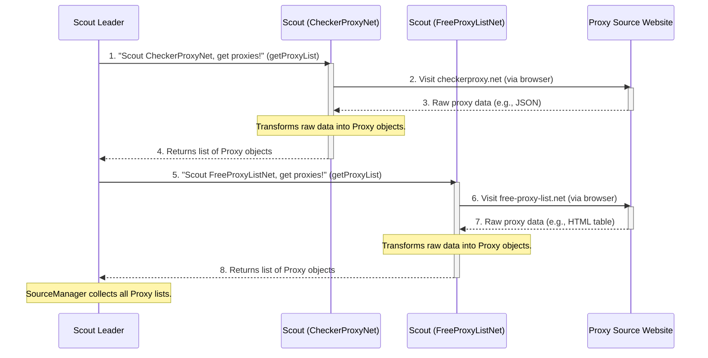

# Chapter 5: Individual Proxy Source Scraper (ISource)

Welcome back, explorer! In our last chapter, [Chapter 4: External Proxy Gatherer (SourceManager)](04_external_proxy_gatherer__sourcemanager__.md), we learned that `SourceManager` acts as the "Scout Leader." Its job is to launch a special background browser and dispatch many specialized "scouts" to find proxies on various websites.

But what exactly *are* these individual "scouts"? How do they know *how* to find proxies on their specific websites? This is where the **`Individual Proxy Source Scraper`**, or **`ISource`**, comes in!

### What Problem Does ISource Solve?

Imagine you're the `SourceManager`, and you have a list of 10 different websites that provide free proxies.
*   `free-proxy-list.net` might list proxies in a simple HTML table.
*   `checkerproxy.net` might offer a direct API link that returns proxies as a JSON file.
*   `my-proxy.com` might have proxies hidden within a page that requires some clever navigation or JavaScript execution.

Each website is like a different puzzle. If you tried to write one giant piece of code in `SourceManager` to solve *all* these puzzles, it would quickly become a tangled, unmanageable mess!

`ISource` solves this problem by defining a **standard "job description" or "contract"** for all these specialized "scouts." Each scout (an implementation of `ISource`) agrees to follow this contract: "I will go to my specific website and bring back a list of `Proxy` objects." How each scout does this job is up to them, based on the website they are experts at.

This modular design makes it easy for `proxyOPI` to add new proxy sources without changing the core `SourceManager` logic. Just create a new `ISource` implementation, and `SourceManager` will know how to use it!

### Your Goal: Understanding the Specialized Scouts

By the end of this chapter, you'll understand how `ISource` defines the behavior for individual proxy source scrapers, enabling `proxyOPI` to collect proxies from diverse online sources in a standardized way.

---

### The ISource's Role: The Specialized Scout

Think of `ISource` as a specialized "scout" with a very specific mission:
1.  **Expert on One Website**: Each `ISource` implementation is an expert at navigating *one particular* proxy website (e.g., `CheckerProxyNet` knows `checkerproxy.net`, `FreeProxyListNet` knows `free-proxy-list.net`).
2.  **Knows How to Extract**: It knows exactly where to look on its website, how to read the data (whether it's HTML, JSON, or plain text), and how to pull out the essential proxy details.
3.  **Standardizes Data**: Once it finds the raw IP addresses, ports, and other details, it transforms them into our standard `Proxy` objects (as learned in [Chapter 3: Proxy Data Models (Proxy, ProxyListTS, Protocol, AnonymityLevel)](03_proxy_data_models__proxy__proxylistts__protocol__anonymitylevel__.md)).

### How SourceManager Uses ISource (Behind the Scenes)

Let's zoom in on the interaction where `SourceManager` (the Scout Leader) dispatches its individual scouts (`ISource` implementations):



As you can see, `SourceManager` simply tells each scout to "get proxies." Each scout then uses its specialized knowledge to interact with its target website and return a standardized list of `Proxy` objects.

### Diving into the Code: The `ISource` Interface

The `ISource` "contract" is defined as an interface in `src/sources/iSource.ts`.

#### `src/sources/iSource.ts`

```typescript
// src/sources/iSource.ts
import { Browser } from "playwright-core"; // We still need the browser!
import { Proxy } from "../types.js"; // To return Proxy objects

export default interface ISource {
    readonly source: string;     // The name of the proxy source (e.g., "checkerproxy.net")
    browser: Browser;            // The shared browser instance from SourceManager
    getProxyList(): Promise<Proxy[]>; // The core method to fetch proxies
    pageOptions?: {};            // Optional settings for the page
}
```

This interface is very simple, but powerful:
*   **`readonly source: string;`**: Every scout needs to declare *which* website it's an expert for.
*   **`browser: Browser;`**: Each scout needs access to the headless browser that `SourceManager` launched. This allows them to "visit" websites.
*   **`getProxyList(): Promise<Proxy[]>;`**: This is the most important part. It's the promise that every scout makes: "I will provide a list (`Proxy[]`) of found proxies, and I'll do it asynchronously (`Promise`)."

Any class that wants to be a "scout" for `proxyOPI` **must** implement this `ISource` interface.

### Example Scout: `CheckerProxyNet`

Let's look at a simplified version of `src/sources/checkerproxy_net.ts` to see an `ISource` implementation in action. This scout knows how to get proxies from `checkerproxy.net`.

```typescript
// src/sources/checkerproxy_net.ts (simplified)
import { Browser } from "playwright-core";
import { Proxy, AnonymityLevel, Protocol } from "../types.js"; // Our data models!
import ISource from "./iSource.js"; // Our ISource contract

export default class CheckerProxyNet implements ISource {

    url: string = "https://checkerproxy.net/api/archive/..."; // Specific API URL
    readonly source: string = "checkerproxy.net"; // Declares its source

    constructor(public browser: Browser, private browserContextOptions?: any) {
        // The browser is passed from SourceManager
        this.url = "https://checkerproxy.net/api/archive/" + new Date().toJSON().slice(0, 10);
    }

    async getProxyList(): Promise<Proxy[]> {
        const proxyList: Proxy[] = [];
        const context = await this.browser.newContext(this.browserContextOptions);
        const page = await context.newPage(); // Get a new page from the browser

        // This scout directly makes an API request to its specific URL
        await page.request.get(this.url).then(async response => {
            if (response.status() === 200) {
                // Raw data from the website (in this case, JSON)
                const proxiesFromWebsite = await response.json(); // Simplified

                for (const proxyData of proxiesFromWebsite) {
                    const ipPort = proxyData.addr?.split(":");
                    // Transform raw data into our standard enums (Chapter 3)
                    let protocols: Protocol[] = this.transformProtocol(proxyData.type ?? 0);
                    let anonymity: AnonymityLevel = this.transformAnonymityLevel(proxyData.kind ?? 0);

                    // Create a Proxy object using our defined 'Proxy' type!
                    proxyList.push({
                        ipAddress: ipPort[0],
                        port: Number(ipPort[1]),
                        protocols: protocols,
                        source: this.source,
                        anonymityLevel: anonymity,
                        country: proxyData.addr_geo_iso,
                        // ... other fields
                    });
                }
            }
        }).catch(err => {
            console.error(`Error scraping ${this.source}: ${err}`);
        });

        await page.close();
        await context.close();
        return proxyList;
    }

    // Helper methods to convert raw website codes to our standard enums
    transformProtocol(type: number): Protocol[] { /* ... logic ... */ return [Protocol.http]; }
    transformAnonymityLevel(kind: number): AnonymityLevel { /* ... logic ... */ return AnonymityLevel.anonymous; }
}
```

In this `CheckerProxyNet` example:
*   It `implements ISource`, fulfilling the contract.
*   It uses the `browser` instance it received to create a `page`.
*   It specifically targets its `url` (`https://checkerproxy.net/api/archive/...`).
*   It processes the *raw JSON data* it receives from that URL.
*   It then **transforms** the website's specific data (like numeric codes for protocol and anonymity) into our `Protocol` and `AnonymityLevel` enums (from [Chapter 3](03_proxy_data_models__proxy__proxylistts__protocol__anonymitylevel__.md)).
*   Finally, it constructs and returns a `Proxy[]` (a list of `Proxy` objects), exactly as `ISource` requires.

### Another Example: `FreeProxyListNet`

Some websites don't offer a clean API; they just have an HTML page. For these, an `ISource` implementation might delegate some of its work to another component called `IPage` (which we'll explore in the next chapter!). This shows the flexibility of the `ISource` contract.

Here's a simplified look at `src/sources/free-proxy-list_net.ts`:

```typescript
// src/sources/free-proxy-list_net.ts (simplified)
import { Browser } from "playwright-core";
import { Proxy } from "../types.js";
import ISource from "./iSource.js";
import PageFreeProxyListNet from "./pages/pageFreeProxyListNet.js"; // A helper for page scraping

export default class FreeProxyListNet implements ISource {

    readonly urls = ['https://free-proxy-list.net/', 'https://www.us-proxy.org/', /* ... more ... */];
    readonly source = "free-proxy-list.net";

    constructor(public browser: Browser, private browserContextOptions?: any) { }

    async getProxyList(): Promise<Proxy[]> {
        const proxyList: Proxy[] = [];
        let promises: Promise<void>[] = [];

        for (const url of this.urls) { // This scout might visit multiple URLs
            const promise = this.browser.newContext(this.browserContextOptions).then(async context => {
                // Instead of scraping directly, it uses a dedicated page scraper (IPage)
                await PageFreeProxyListNet.constructAsync(context, url, this.source).then(async pageScraper => {
                    await pageScraper?.getProxies().then(proxies => {
                        proxyList.push(...proxies);
                    });
                });
                await context.close();
            });
            promises.push(promise);
        }
        await Promise.allSettled(promises); // Wait for all pages to be scraped
        return proxyList;
    }
}
```
In this case, `FreeProxyListNet` still adheres to the `ISource` contract by providing `getProxyList()`. However, instead of parsing the HTML itself, it delegates that work to `PageFreeProxyListNet`, which is an implementation of `IPage`. This allows for even more specialized logic for complex web pages, while `ISource` remains the overarching contract for "getting proxies from a source."

---

### Conclusion

You've now met the individual "scouts" of the `proxyOPI` system: the `ISource` implementations. You learned that `ISource` acts as a crucial contract, ensuring that every specialized scraper knows its job: to visit a specific online proxy source, extract the relevant data, transform it into a standardized list of `Proxy` objects, and return it to the `SourceManager`.

This modular approach allows `proxyOPI` to easily expand its list of proxy sources and adapt to the unique structure of each website.

Now that we understand what a specialized scout (`ISource`) is, let's dive deeper into how some of these scouts actually perform their web page scraping for more complex HTML sources.

[Next Chapter: Web Page Scraper Logic (IPage)](06_web_page_scraper_logic__ipage__.md)

---

<sub><sup>Generated by [AI Codebase Knowledge Builder](https://github.com/The-Pocket/Tutorial-Codebase-Knowledge).</sup></sub> <sub><sup>**References**: [[1]](https://github.com/yasirerkam/proxyOPI/blob/de777b25b178688cfd9509a60298c2a610fb318d/src/sourceManager.ts), [[2]](https://github.com/yasirerkam/proxyOPI/blob/de777b25b178688cfd9509a60298c2a610fb318d/src/sources/checkerproxy_net.ts), [[3]](https://github.com/yasirerkam/proxyOPI/blob/de777b25b178688cfd9509a60298c2a610fb318d/src/sources/cool-proxy_net.ts), [[4]](https://github.com/yasirerkam/proxyOPI/blob/de777b25b178688cfd9509a60298c2a610fb318d/src/sources/free-proxy-list_net.ts), [[5]](https://github.com/yasirerkam/proxyOPI/blob/de777b25b178688cfd9509a60298c2a610fb318d/src/sources/free-proxy_cz.ts), [[6]](https://github.com/yasirerkam/proxyOPI/blob/de777b25b178688cfd9509a60298c2a610fb318d/src/sources/hideip_me.ts), [[7]](https://github.com/yasirerkam/proxyOPI/blob/de777b25b178688cfd9509a60298c2a610fb318d/src/sources/hidemy_io.ts), [[8]](https://github.com/yasirerkam/proxyOPI/blob/de777b25b178688cfd9509a60298c2a610fb318d/src/sources/iSource.ts), [[9]](https://github.com/yasirerkam/proxyOPI/blob/de777b25b178688cfd9509a60298c2a610fb318d/src/sources/my-proxy_com.ts), [[10]](https://github.com/yasirerkam/proxyOPI/blob/de777b25b178688cfd9509a60298c2a610fb318d/src/sources/openproxy_space.ts), [[11]](https://github.com/yasirerkam/proxyOPI/blob/de777b25b178688cfd9509a60298c2a610fb318d/src/sources/premproxy_com.ts), [[12]](https://github.com/yasirerkam/proxyOPI/blob/de777b25b178688cfd9509a60298c2a610fb318d/src/sources/proxy-daily_com.ts), [[13]](https://github.com/yasirerkam/proxyOPI/blob/de777b25b178688cfd9509a60298c2a610fb318d/src/sources/proxy-list_org.ts), [[14]](https://github.com/yasirerkam/proxyOPI/blob/de777b25b178688cfd9509a60298c2a610fb318d/src/sources/proxynova_com.ts), [[15]](https://github.com/yasirerkam/proxyOPI/blob/de777b25b178688cfd9509a60298c2a610fb318d/src/sources/proxyscrape_com.ts)</sup></sub>
