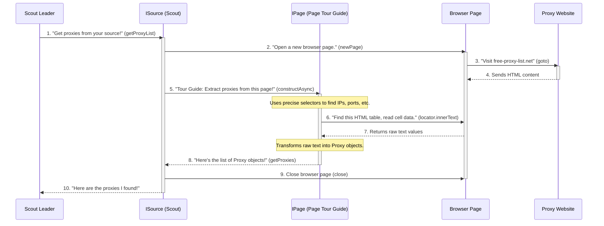

# Chapter 6: Web Page Scraper Logic (IPage)

Welcome back, intrepid explorer! In our last chapter, [Chapter 5: Individual Proxy Source Scraper (ISource)](05_individual_proxy_source_scraper__isource__.md), we learned about `ISource` implementations—our specialized "scouts" that go out and fetch proxies from specific websites. Some of these scouts, like `CheckerProxyNet`, might fetch proxies directly from an API (a machine-friendly data source). But what about websites that just display proxies in a normal web page, perhaps in an HTML table or hidden within complex JavaScript?

This is where the **`Web Page Scraper Logic`**, or **`IPage`**, comes into play.

### What Problem Does IPage Solve?

Imagine you're an `ISource` scout, and your mission is to get proxies from `free-proxy-list.net`. You visit the page, and instead of a clean data feed, you see a regular website with a big HTML table full of IP addresses, ports, and other details.

Your `ISource` self knows *which* website to visit, but it doesn't want to get bogged down in the tiny details of *how* to find the "IP Address" column, the "Port" column, or how to click buttons if needed. If every `ISource` had to understand the unique layout of every single web page, the code would be messy and hard to maintain.

`IPage` solves this by acting as a **"Tour Guide"** for a *specific web page*. Each `IPage` implementation knows exactly how to navigate one particular page's layout and where to find the data it needs. It's like having a detailed map and instructions for *just one room* in a huge house.

### Your Goal: Understanding How `IPage` Guides Data Extraction

By the end of this chapter, you'll understand how `IPage` provides the precise instructions for extracting data from specific web page structures, transforming raw HTML into usable `Proxy` objects.

---

### The IPage's Role: The Web Page Tour Guide

Think of an `IPage` implementation as an expert tour guide for a particular web page. When an `ISource` scout needs to get proxies from an HTML-based website, it hands the web page over to its specialized `IPage` tour guide.

Here's what an `IPage` tour guide does:

1.  **Navigates the Page**: It knows how to "go to" a specific web page URL using the shared browser.
2.  **Identifies Key Locations**: It knows the exact "address" (using special selectors like XPath or CSS selectors) of the HTML elements where the proxy data (IP, port, country, etc.) is located.
3.  **Extracts Data**: It pulls out the text or attributes from these identified elements.
4.  **Translates Information**: It understands that a web page might say "High-Anonymous" but that means `AnonymityLevel.elite` in our system. It translates the raw web page data into our standard `Protocol` and `AnonymityLevel` enums (from [Chapter 3: Proxy Data Models (Proxy, ProxyListTS, Protocol, AnonymityLevel)](03_proxy_data_models__proxy__proxylistts__protocol__anonymitylevel__.md)).
5.  **Builds `Proxy` Objects**: Finally, it takes all the extracted and translated pieces of information and constructs a list of `Proxy` objects.

This way, the `ISource` scout doesn't need to worry about the web page's layout; it just asks the `IPage` tour guide to "get me the proxies from this page," and the tour guide handles all the intricate details.

### How `ISource` Uses `IPage` (Behind the Scenes)

Let's look at how an `ISource` (like `FreeProxyListNet` from the previous chapter) delegates to an `IPage` (like `PageFreeProxyListNet`):



This diagram illustrates that `FreeProxyListNet` (the `ISource` scout) doesn't do the detailed HTML parsing itself. Instead, it creates an `IPage` (the `PageFreeProxyListNet` tour guide), provides it with the browser page, and tells it to "get proxies." The `IPage` then performs the detailed scraping.

### Diving into the Code: The `IPage` Interface

The `IPage` "contract" is defined in `src/sources/pages/iPage.ts`.

#### `src/sources/pages/iPage.ts`

```typescript
// src/sources/pages/iPage.ts
import { Proxy } from "../../types.js"; // To return Proxy objects

export default interface IPage {
    getProxies(): Promise<Proxy[]>; // The core method to fetch proxies
}
```

This interface is wonderfully simple! It declares one promise: "I will provide a list (`Proxy[]`) of found proxies, asynchronously (`Promise`)." Any class that is an `IPage` tour guide must fulfill this promise.

### Example IPage Implementation: `PageFreeProxyListNet`

Let's look at a simplified version of `src/sources/pages/pageFreeProxyListNet.ts` to see how an `IPage` tour guide works. This specific guide knows how to extract proxies from `free-proxy-list.net`.

```typescript
// src/sources/pages/pageFreeProxyListNet.ts (simplified)
import { Page } from "playwright-core"; // To interact with the web page
import { Proxy, Protocol, AnonymityLevel } from "../../types.js"; // Our data models!
import { BrowserContext } from "playwright-core";
import IPage from "./iPage.js"; // Our IPage contract

export default class PageFreeProxyListNet implements IPage {
    // The constructor receives the URL, the browser page, and the source name.
    constructor(public url: string, private page: Page, private source: string) { }

    // This static method is a factory to create an IPage and navigate the browser page.
    static async constructAsync(context: BrowserContext, url: string, source: string) {
        const page = await context.newPage(); // Get a new page
        // Try to navigate to the URL. If successful (status 200), create the IPage object.
        return await page.goto(url).then(response => {
            if (response?.status() === 200)
                return new PageFreeProxyListNet(url, page, source);
        });
    }

    async getProxies(): Promise<Proxy[]> {
        const proxyList: Proxy[] = [];

        // 1. Find all proxy rows in the HTML table
        // We use Playwright's locator to find elements by their XPath or CSS selector
        const proxyRows = await this.page.locator(`//table[@class='table table-striped table-bordered']/tbody/tr`).all();

        // 2. Loop through each row to extract data
        for (const proxyRow of proxyRows) {
            // Find the specific 'td' (table data cell) for each piece of info
            const ipAddress: string = await proxyRow.locator(`/td[1]`).innerText();
            const port: number = Number(await proxyRow.locator(`/td[2]`).innerText());
            const country: string | undefined = await proxyRow.locator(`/td[3]`).innerText();
            // Call helper methods to translate web page text to our enums
            const anonymityLevel: AnonymityLevel = this.transformAnonymityLevel(await proxyRow.locator(`/td[5]`).innerText());
            const protocol: Protocol = this.transformProtocol(await proxyRow.locator(`/td[7]`).innerText());
            const lastChecked: string = await proxyRow.locator(`/td[8]`).innerText();

            // 3. Create a Proxy object using the extracted and transformed data
            const proxy: Proxy = {
                ipAddress: ipAddress,
                port: port,
                country: country,
                anonymityLevel: anonymityLevel,
                protocols: [protocol],
                source: this.source,
                lastTested: lastChecked
            };
            proxyList.push(proxy); // Add to our list
        }

        return proxyList; // Return the list of Proxy objects
    }

    // Helper methods to convert raw web page strings into our standard Protocol enum
    transformProtocol(protocol: string): Protocol {
        switch (protocol.trim().toLowerCase()) {
            case "no": // "no" in this website's table means HTTP
                return Protocol.http;
            case "yes": // "yes" means HTTPS
                return Protocol.https;
            default:
                return Protocol.unknown;
        }
    }

    // Helper methods to convert raw web page strings into our standard AnonymityLevel enum
    transformAnonymityLevel(anonymityLevel: string): AnonymityLevel {
        switch (anonymityLevel.trim().toLowerCase()) {
            case "transparent":
                return AnonymityLevel.transparent;
            case "anonymous":
                return AnonymityLevel.anonymous;
            case "elite proxy":
                return AnonymityLevel.elite;
            default:
                return AnonymityLevel.unknown;
        }
    }
}
```

In this `PageFreeProxyListNet` example:
*   It `implements IPage`, fulfilling the contract.
*   The `constructAsync` method is like a gatekeeper; it only creates an `IPage` object if the web page is successfully loaded (HTTP status 200).
*   Inside `getProxies()`, it uses `this.page.locator(...)` from Playwright. These locators are like precise directions to find specific parts of the HTML.
    *   `//table[@class='table table-striped table-bordered']/tbody/tr` finds all rows in the main proxy table.
    *   `/td[1]`, `/td[2]`, etc., find the data in the first, second, etc., columns of each row.
*   `await proxyRow.locator(...).innerText()` reads the visible text content from those HTML elements.
*   The `transformProtocol` and `transformAnonymityLevel` methods are crucial! They take the website's specific text (like "no" or "elite proxy") and convert it into our universal `Protocol` and `AnonymityLevel` enums (from [Chapter 3](03_proxy_data_models__proxy__proxylistts__protocol__anonymitylevel__.md)).
*   Finally, all this processed data is used to construct `Proxy` objects, which are then added to `proxyList` and returned.

This is a clear demonstration of how `IPage` handles the specific, low-level details of parsing a web page's content, making it a powerful and flexible component for adding new proxy sources that rely on HTML scraping.

### Conclusion

You've now explored the specialized "Tour Guides" of the `proxyOPI` system: the `IPage` implementations. You learned that `IPage` is dedicated to providing the precise instructions for extracting data from a specific web page's layout. It uses powerful tools like Playwright's `locator` to navigate HTML, extracts raw text, transforms it into our standard `Proxy` data models, and ultimately delivers a list of usable `Proxy` objects.

This modularity allows `ISource` implementations to focus on orchestrating the fetching from a *source*, while `IPage` implementations handle the intricate details of *how* to scrape a particular web page structure.

Now that we understand how proxies are found and structured, let's look at how `proxyOPI` stores and retrieves these valuable lists using a file system.

[Next Chapter: JSON File Handler (JsonFileOps)](07_json_file_handler__jsonfileops__.md)

---

<sub><sup>Generated by [AI Codebase Knowledge Builder](https://github.com/The-Pocket/Tutorial-Codebase-Knowledge).</sup></sub> <sub><sup>**References**: [[1]](https://github.com/yasirerkam/proxyOPI/blob/de777b25b178688cfd9509a60298c2a610fb318d/src/sources/pages/iPage.ts), [[2]](https://github.com/yasirerkam/proxyOPI/blob/de777b25b178688cfd9509a60298c2a610fb318d/src/sources/pages/pageFreeProxyCz.ts), [[3]](https://github.com/yasirerkam/proxyOPI/blob/de777b25b178688cfd9509a60298c2a610fb318d/src/sources/pages/pageFreeProxyListNet.ts), [[4]](https://github.com/yasirerkam/proxyOPI/blob/de777b25b178688cfd9509a60298c2a610fb318d/src/sources/pages/pageHideMyIo.ts), [[5]](https://github.com/yasirerkam/proxyOPI/blob/de777b25b178688cfd9509a60298c2a610fb318d/src/sources/pages/pageMyProxyCom.ts), [[6]](https://github.com/yasirerkam/proxyOPI/blob/de777b25b178688cfd9509a60298c2a610fb318d/src/sources/pages/pageOpenproxySpace.ts), [[7]](https://github.com/yasirerkam/proxyOPI/blob/de777b25b178688cfd9509a60298c2a610fb318d/src/sources/pages/pagePremProxyCom.ts), [[8]](https://github.com/yasirerkam/proxyOPI/blob/de777b25b178688cfd9509a60298c2a610fb318d/src/sources/pages/pageProxyDailyCom.ts), [[9]](https://github.com/yasirerkam/proxyOPI/blob/de777b25b178688cfd9509a60298c2a610fb318d/src/sources/pages/pageProxyListOrg.ts), [[10]](https://github.com/yasirerkam/proxyOPI/blob/de777b25b178688cfd9509a60298c2a610fb318d/src/sources/pages/pageProxyNovaCom.ts)</sup></sub>
