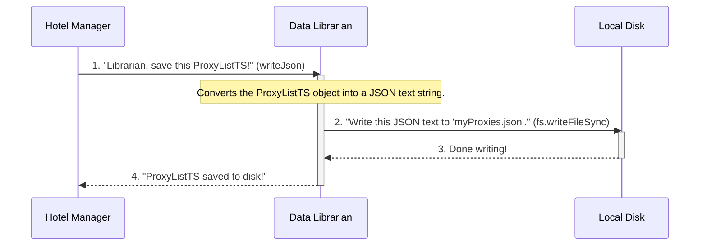
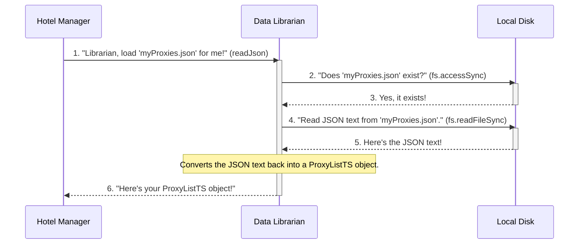

# Chapter 7: JSON File Handler (JsonFileOps)

Welcome back, intrepid explorer! In our last chapter, [Chapter 6: Web Page Scraper Logic (IPage)](06_web_page_scraper_logic__ipage__.md), we saw how `IPage` implementations meticulously extract raw proxy data from complex web pages and transform it into structured `Proxy` objects. By the time this data reaches the [Proxy List Manager (ProxyProvider)](02_proxy_list_manager__proxyprovider__.md), we have a valuable `ProxyListTS` (a "box of proxy ID cards") in memory.

But what happens to this hard-earned list if your application restarts or crashes? All that data would be lost! This is where the **`JSON File Handler`**, or **`JsonFileOps`**, steps in.

### What Problem Does JsonFileOps Solve?

Imagine our [Proxy List Manager (ProxyProvider)](02_proxy_list_manager__proxyprovider__.md) has just collected a fresh, valid list of hundreds of proxies. It's a goldmine of information! However, this list currently only exists in the computer's temporary memory. If the `proxyOPI` application closes, that list vanishes. The next time you run `proxyOPI`, it would have to go through the entire slow process of scraping all those websites again.

The `JsonFileOps` solves this problem by acting as the **"Librarian" or "Filing Clerk"** for our proxy data. Its main job is to:
*   **Reliably store** your valuable `ProxyListTS` objects to a local file on your computer's disk.
*   **Efficiently retrieve** that `ProxyListTS` from the disk whenever `ProxyProvider` needs it.

This means that `proxyOPI` can save the collected proxy list, and the next time you ask for proxies, it can *first* check the saved file. If the file exists and the list isn't too old, `proxyOPI` can use the saved list instead of re-scraping, saving a lot of time and resources. This effectively acts as a simple, disk-based **caching mechanism**.

### Your Goal: Understanding How `proxyOPI` Saves and Loads Data

By the end of this chapter, you'll understand how `JsonFileOps` provides the essential functions for making your proxy lists persistent, allowing them to be stored and retrieved from the local file system.

---

### The JsonFileOps's Role: The Data Librarian

Think of `JsonFileOps` as a super-efficient librarian or a specialized filing clerk for JSON files.

Here's how our "Data Librarian" (`JsonFileOps`) handles requests:

1.  **Receives an Object (ProxyListTS)**: When `ProxyProvider` wants to save its `ProxyListTS`, it hands the entire object (our "box of ID cards") to the librarian.
2.  **Converts to Standard Format (JSON String)**: The librarian doesn't just put the "box" on a shelf. It carefully translates all the information from the `ProxyListTS` object into a standardized, human-readable text format called **JSON (JavaScript Object Notation)**. This is like converting a physical book into a digital text file.
3.  **Writes to File**: The librarian then writes this JSON text into a designated file on the disk, making sure it's stored safely.
4.  **Reads from File**: When `ProxyProvider` asks for a list, the librarian checks if the file exists, reads the JSON text from the file, and then converts it back into a usable `ProxyListTS` object for `ProxyProvider`.

This process ensures that complex data structures (like our `ProxyListTS`) can be stored and retrieved reliably, bridging the gap between temporary memory and permanent disk storage.

### How ProxyProvider Uses JsonFileOps (Behind the Scenes)

Let's look at a simplified sequence of events for saving (writing) a proxy list:



And for loading (reading) a proxy list:



### Diving into the Code (`src/jsonFileOps.ts`)

Let's look at the `JsonFileOps` code in `src/jsonFileOps.ts` to see how our "Data Librarian" works.

#### Checking if a File Exists (`isFileExists`)

Before trying to read a file, it's a good idea to check if it actually exists. Our librarian does this first.

```typescript
// src/jsonFileOps.ts (simplified)
import fs from "node:fs"; // Node.js File System module
import PathLb from "path"; // Node.js Path module

export default class JsonFileOps {
    // ... (path setup to find the file correctly) ...

    static isFileExists(pathObj: string): boolean {
        // Combines the current directory with the provided path for accuracy
        pathObj = PathLb.join(JsonFileOps.__dirname, pathObj);

        try {
            // fs.accessSync checks if the file exists and is accessible
            fs.accessSync(pathObj, fs.constants.F_OK);
            return true; // File exists!
        } catch (err) {
            return false; // File does NOT exist
        }
    }
}
```
This `isFileExists` method uses Node.js's built-in `fs.accessSync` function. `fs.constants.F_OK` is a special value that means "check if the file exists." If it finds the file, it returns `true`; otherwise, it returns `false` (often by throwing an error, which we catch). The `PathLb.join` part is important for correctly building the file path, making sure it works the same way across different operating systems.

#### Reading a JSON File (`readJson`)

This is how our librarian loads a `ProxyListTS` from a file.

```typescript
// src/jsonFileOps.ts (simplified)
import fs from "node:fs";
import PathLb from "path";

export default class JsonFileOps {
    // ... (isFileExists and path setup) ...

    static readJson(pathObj: string) {
        pathObj = PathLb.join(JsonFileOps.__dirname, pathObj); // Build full path
        let obj: any;

        try {
            console.log(`\n'${PathLb.parse(pathObj).base}' is reading...`);
            // 1. Read the raw text content of the file
            const dictData = fs.readFileSync(pathObj, 'utf-8');
            // 2. Parse the JSON text into a JavaScript object
            obj = JSON.parse(dictData);
            console.log(`'${PathLb.parse(pathObj).base}' has been read.`);
        } catch (error: any) {
            if (error.code === 'ENOENT') {
                console.warn(`'${pathObj}' is not found. Create it first!`);
                return undefined; // File not found, return nothing
            }
            console.error(`An error occurred while reading: ${error}`);
            return undefined; // Other error, return nothing
        }
        return obj; // Return the JavaScript object
    }
}
```
The `readJson` method first builds the full path to the file. Then, inside a `try...catch` block (to handle potential errors):
1.  `fs.readFileSync(pathObj, 'utf-8')` reads the entire content of the file as a plain text string. The `'utf-8'` ensures it's read correctly.
2.  `JSON.parse(dictData)` is the magic! It takes the JSON text string and converts it into a regular JavaScript object (which will be our `ProxyListTS` object).
If the file doesn't exist (`ENOENT` error), it prints a warning and returns `undefined`. For any other error, it logs an error and also returns `undefined`.

#### Writing a JSON File (`writeJson`)

This is how our librarian saves a `ProxyListTS` to a file.

```typescript
// src/jsonFileOps.ts (simplified)
import fs from "node:fs";
import PathLb from "path";

export default class JsonFileOps {
    // ... (isFileExists, readJson and path setup) ...

    static writeJson(obj: any, pathObj: string, options: any, format = false) {
        pathObj = PathLb.join(JsonFileOps.__dirname, pathObj); // Build full path

        try {
            console.log(`\n'${PathLb.parse(pathObj).base}' is writing...`);
            let dictData;
            if (format)
                // Convert object to a formatted JSON string (with indentations for readability)
                dictData = JSON.stringify(obj, null, 4);
            else
                // Convert object to a compact JSON string
                dictData = JSON.stringify(obj);
            // Write the JSON string to the file
            fs.writeFileSync(pathObj, dictData, options);
            console.log(`'${PathLb.parse(pathObj).base}' is written.`);
        } catch (error) {
            console.error(`An error occurred while writing: ${error}`);
            return;
        }
    }
}
```
The `writeJson` method also starts by building the full file path. Then:
1.  `JSON.stringify(obj)` takes a JavaScript object (like our `ProxyListTS`) and converts it into a JSON text string. If `format` is `true`, `JSON.stringify(obj, null, 4)` adds nice indentations, making the file easy for humans to read.
2.  `fs.writeFileSync(pathObj, dictData, options)` then writes this JSON text string to the specified file. The `options` parameter can control things like whether to overwrite an existing file.

#### JsonFileOps in `ProxyProvider`

You can see `JsonFileOps` being used in `src/proxyProvider.ts`. Remember, `ProxyProvider` is the "Hotel Manager" that decides *when* to save and load lists.

Here's how `ProxyProvider` uses `JsonFileOps` when setting a new proxy list:

```typescript
// src/proxyProvider.ts (simplified)
import JsonFileOps from "./jsonFileOps.js"; // Import our librarian!
import { ProxyListTS } from "./types.js";

export default class ProxyProvider {
    // ... (other properties and methods) ...
    private proxyListTS!: ProxyListTS;
    private pathProxyList: string; // Path to the file for saving/loading

    setProxyList(value: ProxyListTS, save: boolean = true) {
        this.proxyListTS = value;
        // ... (shuffling logic) ...
        if (save)
            this.writeProxyListObjFile(); // Call our helper to save!
    }

    private writeProxyListObjFile(format = false) {
        // Ask the JsonFileOps librarian to write the current list
        JsonFileOps.writeJson(this.proxyListTS, this.pathProxyList, { flag: 'w' }, format);
    }

    // ... (other methods) ...
}
```
And here's how `ProxyProvider` uses `JsonFileOps` when trying to *read* a previously saved list during its initialization:

```typescript
// src/proxyProvider.ts (simplified)
import JsonFileOps from "./jsonFileOps.js"; // Import our librarian!
import { ProxyListTS } from "./types.js";

export default class ProxyProvider {
    // ... (constructor and other methods) ...

    private async readProxyListObjFileAsync(): Promise<void> {
        try {
            // 1. Ask the JsonFileOps librarian: "Does this file exist?"
            if (!JsonFileOps.isFileExists(this.pathProxyList)) {
                // If not, we need to get a new list from scratch
                await this.getNewProxyListAsync();
            } else {
                // 2. Ask the JsonFileOps librarian: "Please read this file!"
                const proxyListTS = JsonFileOps.readJson(this.pathProxyList);

                // If the read list is valid, use it
                if (!proxyListTS || !proxyListTS.dateTime || !proxyListTS.list || proxyListTS.list.length == 0)
                    await this.getNewProxyListAsync(); // List was empty or invalid, get new one
                else
                    this.setProxyList(proxyListTS, false); // Use the loaded list
            }
        }
        catch (error) {
            console.log("\nError occurred while reading proxy list:\n", error);
            await this.getNewProxyListAsync(); // An error occurred, so get a new list
        }
    }
    // ... (other methods) ...
}
```
These snippets clearly show `ProxyProvider` delegating the actual file system operations to `JsonFileOps`, treating it as a specialized tool for handling JSON data persistence.

### Conclusion

In this chapter, you've understood the crucial role of the `JsonFileOps` in `proxyOPI`. You learned that it acts as the "Data Librarian," providing reliable and easy-to-use methods for saving (`writeJson`) and loading (`readJson`) your valuable `ProxyListTS` objects to and from the local file system. This capability is essential for ensuring that `proxyOPI` can persist its collected proxy lists, allowing for efficient disk-based caching and preventing the loss of hard-earned data upon application restarts.

With `JsonFileOps` completing the picture, you now have a comprehensive understanding of all the core components that work together in `proxyOPI` to deliver fresh and reliable proxy lists! You've learned about the user-facing entry point ([Proxy API Entry Point (ProxyOPI)](01_proxy_api_entry_point__proxyopi__.md)), the intelligent list manager ([Proxy List Manager (ProxyProvider)](02_proxy_list_manager__proxyprovider__.md)), the data structures ([Proxy Data Models (Proxy, ProxyListTS, Protocol, AnonymityLevel)](03_proxy_data_models__proxy__proxylistts__protocol__anonymitylevel__.md)), the external data gatherer ([External Proxy Gatherer (SourceManager)](04_external_proxy_gatherer__sourcemanager__.md)), the individual source scrapers ([Individual Proxy Source Scraper (ISource)](05_individual_proxy_source_scraper__isource__.md)), the web page parsing logic ([Web Page Scraper Logic (IPage)](06_web_page_scraper_logic__ipage__.md)), and finally, the data persistence mechanism (`JsonFileOps`).

Congratulations on completing this journey through the core architecture of `proxyOPI`!

---

<sub><sup>Generated by [AI Codebase Knowledge Builder](https://github.com/The-Pocket/Tutorial-Codebase-Knowledge).</sup></sub> <sub><sup>**References**: [[1]](https://github.com/yasirerkam/proxyOPI/blob/de777b25b178688cfd9509a60298c2a610fb318d/src/jsonFileOps.ts), [[2]](https://github.com/yasirerkam/proxyOPI/blob/de777b25b178688cfd9509a60298c2a610fb318d/src/proxyProvider.ts), [[3]](https://github.com/yasirerkam/proxyOPI/blob/de777b25b178688cfd9509a60298c2a610fb318d/src/sourceManager.ts)</sup></sub>
