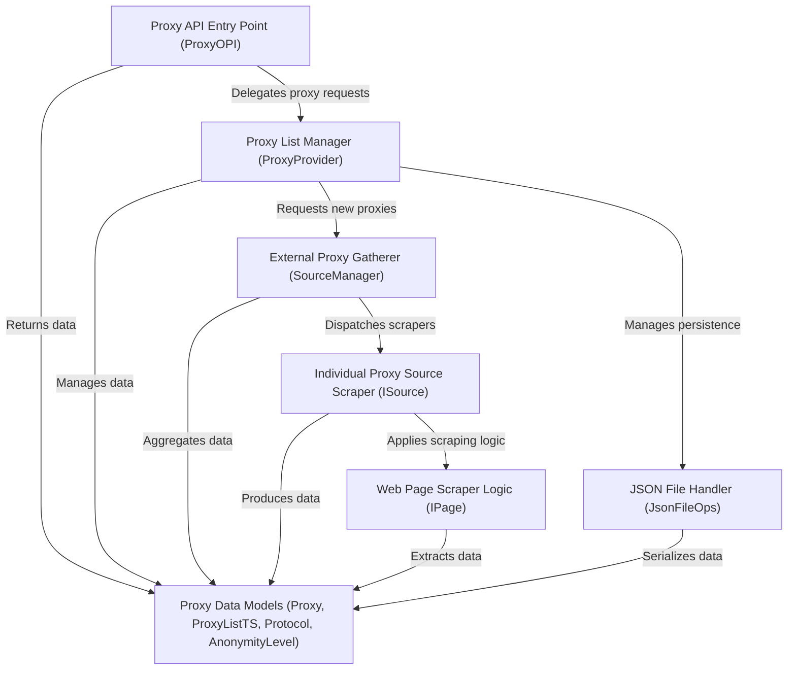

# Tutorial: proxyOPI

ProxyOPI is a **free proxy API** that *automates the process* of finding and managing free proxy servers from various online sources. It acts as a central service to *fetch, store, and provide* up-to-date lists of proxies, simplifying how applications can access and utilize them.

## Visual Overview

## Chapters

1. [Proxy API Entry Point (ProxyOPI)
](01_proxy_api_entry_point__proxyopi__.md)
2. [Proxy List Manager (ProxyProvider)
](02_proxy_list_manager__proxyprovider__.md)
3. [Proxy Data Models (Proxy, ProxyListTS, Protocol, AnonymityLevel)
](03_proxy_data_models__proxy__proxylistts__protocol__anonymitylevel__.md)
4. [External Proxy Gatherer (SourceManager)
](04_external_proxy_gatherer__sourcemanager__.md)
5. [Individual Proxy Source Scraper (ISource)
](05_individual_proxy_source_scraper__isource__.md)
6. [Web Page Scraper Logic (IPage)
](06_web_page_scraper_logic__ipage__.md)
7. [JSON File Handler (JsonFileOps)
](07_json_file_handler__jsonfileops__.md)

---

Generated by [AI Codebase Knowledge Builder](https://github.com/The-Pocket/Tutorial-Codebase-Knowledge).
