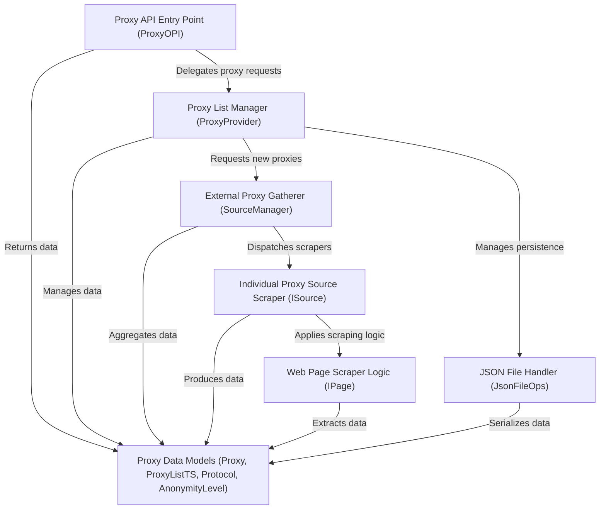

# Tutorial: proxyOPI

ProxyOPI is a **free proxy API** that *automates the process* of finding and managing free proxy servers from various online sources. It acts as a central service to *fetch, store, and provide* up-to-date lists of proxies, simplifying how applications can access and utilize them.

## Visual Overview

## Chapters

1. [Proxy API Entry Point (ProxyOPI)
](https://github.com/yasirerkam/proxyOPI/blob/main/Codebase%20to%20Tutorial/Chapter%201%3A%20Proxy%20API%20Entry%20Point%20(ProxyOPI).md)
2. [Proxy List Manager (ProxyProvider)
](https://github.com/yasirerkam/proxyOPI/blob/yasirerkam-CodebasetoTutorial/Codebase%20to%20Tutorial/Chapter%202%3A%20Proxy%20List%20Manager%20(ProxyProvider).md)
3. [Proxy Data Models (Proxy, ProxyListTS, Protocol, AnonymityLevel)
](https://github.com/yasirerkam/proxyOPI/blob/yasirerkam-CodebasetoTutorial/Codebase%20to%20Tutorial/Chapter%203%3A%20Proxy%20Data%20Models%20(Proxy%2C%20ProxyListTS%2C%20Protocol%2C%20AnonymityLevel).md)
4. [External Proxy Gatherer (SourceManager)](https://github.com/yasirerkam/proxyOPI/blob/yasirerkam-CodebasetoTutorial/Codebase%20to%20Tutorial/Chapter%204%3A%20External%20Proxy%20Gatherer%20(SourceManager).md)
5. [Individual Proxy Source Scraper (ISource)
](https://github.com/yasirerkam/proxyOPI/blob/yasirerkam-CodebasetoTutorial/Codebase%20to%20Tutorial/Chapter%205%3A%20Individual%20Proxy%20Source%20Scraper%20(ISource).md)
6. [Web Page Scraper Logic (IPage)
](https://github.com/yasirerkam/proxyOPI/blob/yasirerkam-CodebasetoTutorial/Codebase%20to%20Tutorial/Chapter%206%3A%20Web%20Page%20Scraper%20Logic%20(IPage).md)
7. [JSON File Handler (JsonFileOps)
](https://github.com/yasirerkam/proxyOPI/blob/yasirerkam-CodebasetoTutorial/Codebase%20to%20Tutorial/Chapter%207%3A%20JSON%20File%20Handler%20(JsonFileOps).md)

---

Generated by [AI Codebase Knowledge Builder](https://github.com/The-Pocket/Tutorial-Codebase-Knowledge).
